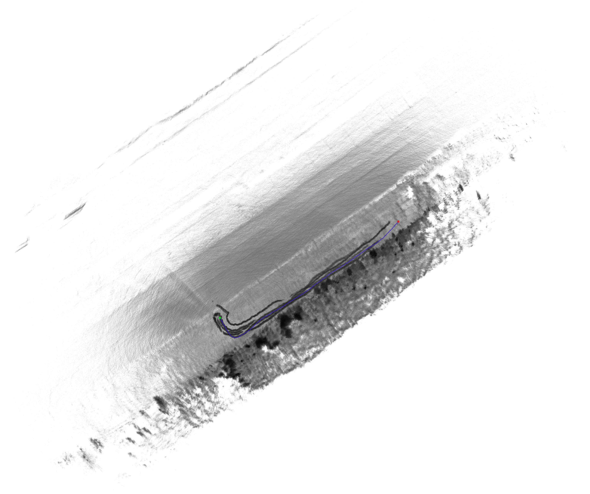

# cartographer
This is fork of https://github.com/cartographer-project/cartographer


## Installment
Make sure your **CMAKE>3.6.0**
To upgrade cmake

```
version=3.x
build=3
mkdir ~/temp
cd ~/temp
wget https://cmake.org/files/v$version/cmake-$version.$build.tar.gz
tar -xzvf cmake-$version.$build.tar.gz
cd cmake-$version.$build/
./bootstrap
make -j4
sudo make install
cmake --version
```

To install cartographer
```
git clone https://github.com/unmannedlab/cartographer.git
sudo apt-get update
sudo apt-get install -y python-wstool python-rosdep ninja-build stow
cd cartographer
src/cartographer/scripts/install_proto3.sh
sudo apt-get install libsuitesparse-dev
catkin_make_isolated --install --use-ninja
```


## Usage:

To perforam on-line slam:

run script
```
cart_config/run_3d_ouster
```


To perforam off-line slam:

run script
```
cart_config/run_3d_offline_ouster
```


visualize results:
```
cart_config/run_vis
```

generate map image and point cloud:

```
cart_config/run_ass
```

## More configuration

Please refer to: https://google-cartographer-ros.readthedocs.io/en/latest/configuration.html